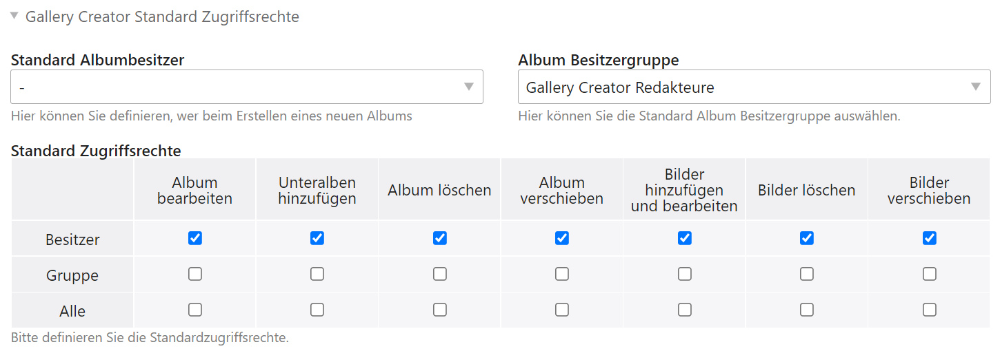

# Gallery Creator Bundle

## Frontend and backend extension for [Contao CMS](https://www.contao.org)

This extension can be used to create, display and manage photo albums in your [Contao](https://www.contao.org) installation.
 The Gallery Creator Bundle offers an album listing and an album detail view.
 Since version 2.0.0 [markdown](https://www.markdownguide.org/) can be used to
  create the album description.

https://user-images.githubusercontent.com/1525166/154361326-cc4dc4c0-60c5-41e3-a0dc-a41fcd3d242e.mp4

## Installation
Please use the Contao Manager or run `composer require markocupic/gallery-creator-bundle`
  in your CLI to install the extension.

## CHMOD
Go to the **Contao Backend Settings** and select a default **album owner**, a **default album owner group** and set the default **access rights**

**Important**: If you keep the "album owner" field empty, the currently logged in backend user automatically becomes the album owner
  when creating a new album.



## Lightbox
 As a lightbox we strongly recommend [Glightbox](https://biati-digital.github.io/glightbox/).
 Simply run the `composer require inspiredminds/contao-glightbox` command in your CLI.
 Please ensure, that you have activated the lightbox template
 in the layout settings of your theme in the Contao backend.

## CSS
Gallery Creator will add the `.gc-listing-view` and/or the `.gc-detail-view` to the
  body tag. This will help you display or hide items you don't want to show in both modes (listing- & detail-view).

```
/** SASS
 * Do not display ce elements headline in detail mode
 *
 */
body.gc-detail-view {
  .ce_gallery_creator {
    h2:not([class^="gc-album-detail-name"]) {
      display: none;
    }
  }
}
```

## Configuration
This gallery extension is shipped with a default configuration.
 If you want to override these settings, you
 can do this in your common configuration file located in `config/config.yml`.

```yaml
# config/config.yml
# Gallery Creator (default settings)
markocupic_gallery_creator:
  upload_path: 'files/gallery_creator_albums'
  copy_images_on_import: true
  read_exif_meta_data: false
  valid_extensions: ['jpg', 'jpeg', 'gif', 'png', 'webp', 'svg', 'svgz']

# Contao configuration
contao:
 url_suffix: ''
 #....
```

## "galleryCreatorGenerateFrontendTemplate" - Hook
Use the "galleryCreatorGenerateFrontendTemplate" hook to adapt the frontend output.

The "galleryCreatorGenerateFrontendTemplate" hook is triggered before the gallery creator
 front end template is parsed.
 It passes the content element object, the template object and the album object of
 the active album (if there is one).
 The "galleryCreatorGenerateFrontendTemplate" hook expects no return value.

```php
<?php
// src/EventListener/GalleryCreatorFrontendTemplateListener.php
declare(strict_types=1);

namespace App\EventListener;

use Contao\CoreBundle\Controller\ContentElement\AbstractContentElementController;
use Contao\CoreBundle\DependencyInjection\Attribute\AsHook;
use Contao\CoreBundle\Twig\FragmentTemplate;
use Markocupic\GalleryCreatorBundle\Model\GalleryCreatorAlbumsModel;

#[AsHook(GalleryCreatorFrontendTemplateListener::HOOK, priority: 100)]
class GalleryCreatorFrontendTemplateListener
{
    public const HOOK = 'galleryCreatorGenerateFrontendTemplate';

    public function __invoke(AbstractContentElementController $contentElement, Fragmenttemplate $template, GalleryCreatorAlbumsModel|null $activeAlbum = null)
    {
        $template->set('foo', 'bar');
    }
}

```


## "galleryCreatorImagePostInsert" - Hook
Use the "galleryCreatorImagePostInsert" hook to adapt the picture entity
  when uploading new images to an album.

The "galleryCreatorImagePostInsert" is executed right after an image
  has been uploaded and has been written to the database.
  It passes the pictures model and expects no return value.

```php
<?php
// src/EventListener/GalleryCreatorImagePostInsertListener.php
declare(strict_types=1);

namespace App\EventListener;

use Contao\BackendUser;
use Contao\CoreBundle\DependencyInjection\Attribute\AsHook;
use Markocupic\GalleryCreatorBundle\Model\GalleryCreatorPicturesModel;
use Symfony\Bundle\SecurityBundle\Security;

#[AsHook(GalleryCreatorImagePostInsertListener::HOOK, priority: 100)]
class GalleryCreatorImagePostInsertListener
{
    public const HOOK = 'galleryCreatorImagePostInsert';

    private Security $security;

    public function __construct(Security $security)
    {
        $this->security = $security;
    }

    public function __invoke(GalleryCreatorPicturesModel $picturesModel): void
    {
        $user = $this->security->getUser();

        // Automatically add a caption to the uploaded image
        if ($user instanceof BackendUser && $user->name) {
            $picturesModel->caption = 'Holidays '.date('Y').', Photo: '.$user->name;
            $picturesModel->save();
        }
    }
}
```


Have fun!
